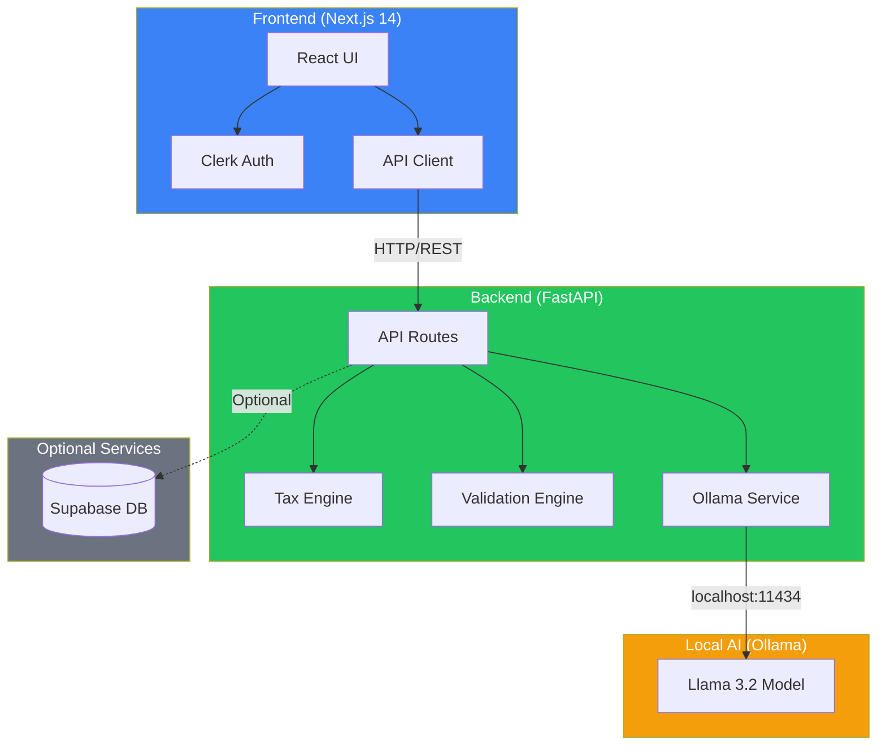

# 🧾 TaxSmart AI - Indian Tax Filing Assistant

AI-powered assistant for Indian citizens to navigate tax filing with ease. Get personalized ITR form recommendations, discover tax deductions, and validate your data before filing.

## ✨ Features

- **ITR Form Selection** - AI determines the correct ITR form based on your income sources
- **Deduction Discovery** - Find all applicable deductions (80C, 80D, HRA, etc.)
- **Tax Calculation** - Compare Old vs New tax regime
- **Error Validation** - Catch common filing mistakes before submission
- **Local AI (Ollama)** - Runs entirely on your machine - no API costs!

## 🏗️ Architecture



### Data Flow
1. **User** interacts with Next.js frontend (authenticated via Clerk)
2. **Frontend** sends API requests to FastAPI backend
3. **Backend** processes requests using Tax Engine and Validation Engine
4. **Ollama Service** calls local Llama 3.2 model for AI responses
5. **Responses** flow back to user in real-time

## 🚀 Quick Start

### Prerequisites
- Node.js 18+ 
- Python 3.10+
- Ollama (for local AI)

### 1. Clone & Install

```bash
git clone https://github.com/yourusername/tax-assistant.git
cd tax-assistant

# Frontend
npm install

# Backend
cd backend
python -m venv venv
.\venv\Scripts\Activate.ps1  # Windows
pip install -r requirements.txt
```

### 2. Install Ollama (Local AI)

```powershell
# Windows
winget install Ollama.Ollama

# Pull the model
ollama pull llama3.2
```

### 3. Set Up Environment

```bash
# Frontend - copy and edit
cp .env.example .env.local
# Edit .env.local with your Clerk keys

# Backend - copy template
cp backend/.env.template backend/.env
```

### 4. Run the App

```bash
# Terminal 1: Backend
cd backend
.\venv\Scripts\Activate.ps1
uvicorn main:app --reload --port 8000

# Terminal 2: Frontend
npm run dev
```

Visit **http://localhost:3000** 🎉

## 🔧 Configuration

### Required: Clerk Authentication
1. Go to https://dashboard.clerk.com
2. Create a new application
3. Copy keys to `.env.local`:
   - `NEXT_PUBLIC_CLERK_PUBLISHABLE_KEY`
   - `CLERK_SECRET_KEY`

### Optional: Supabase Database
For conversation persistence, set up Supabase and add keys to `.env.local`.

## 📁 Project Structure

```
tax-assistant/
├── src/                    # Next.js frontend
│   ├── app/               # Pages
│   ├── components/        # React components
│   └── lib/               # Utilities
├── backend/               # FastAPI backend
│   ├── api/routes/        # API endpoints
│   ├── services/          # Business logic
│   └── knowledge/         # Prompt templates
└── supabase/              # Database schema
```

## 🤖 Tech Stack

- **Frontend**: Next.js 14, TypeScript, Tailwind CSS, shadcn/ui
- **Backend**: FastAPI, Python
- **AI**: Ollama (Llama 3.2) - runs locally
- **Auth**: Clerk
- **Database**: Supabase (optional)

## 📝 License

MIT License - feel free to use for personal or commercial projects.

## 🙏 Contributing

Contributions welcome! Please open an issue first to discuss proposed changes.
